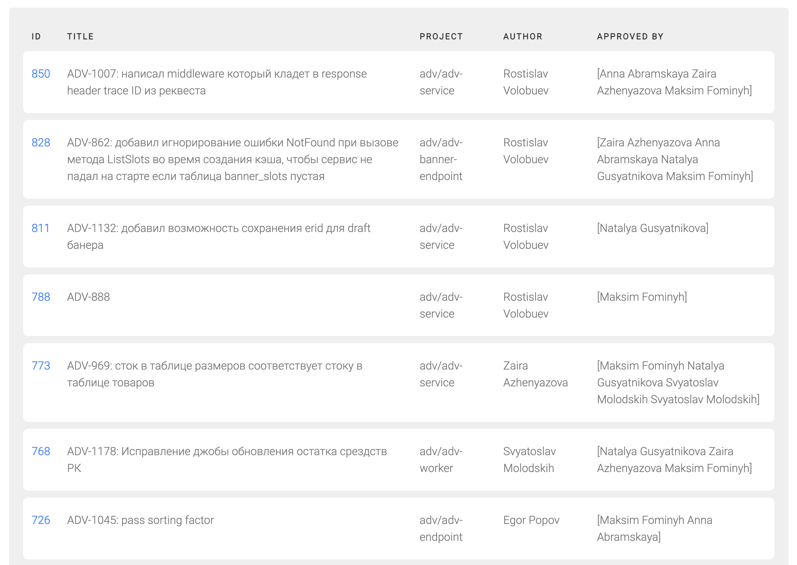

# Setup

Setup environment variables in .env file

```
GITLAB_AUTH_TOKEN=
GITLAB_HOST=
```

1. Set your jira host, example
```example
  GITLAB_HOST=gitlab.ru
```
2. Set your personal auth token. You can create one in https://{GITLAB_HOST}/-/user_settings/personal_access_tokens

# Run

## Run server
Will run http server on 4444 port

```shell
  make run
```

## Open http://localhost:3333/mrs
Will open html page with list of MRs waiting for your review

